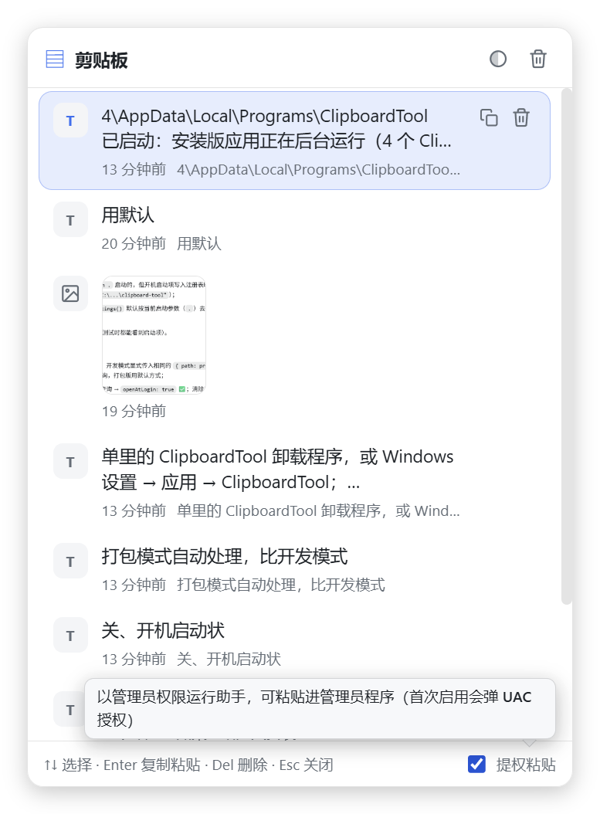

# ClipboardTool —— Windows 剪贴板历史工具

> 基于 **Electron + React + Vite** 的 Windows 桌面剪贴板工具：自动记录文字/图片历史，全局快捷键呼出，一键复制并粘贴回原输入框。


## ✨ 功能特性

- 📋 自动记录复制的**文字**和**图片**（轮询剪贴板、自动去重，最多保留 200 条，本地持久化）
- ⌨️ 全局快捷键 **Ctrl + Shift + V** 呼出面板，**呼出时不会抢占输入框焦点**（光标和输入状态保持不变）
- ⬆️⬇️ 面板显示期间，**↑ / ↓ / Enter / Esc / Del 被全局拦截**，只作用于面板，不会误输入到原程序
- 📌 面板固定在**鼠标所在屏幕正中间**弹出
- ⚡ **Enter** 把选中项复制回剪贴板并**自动粘贴到当前输入框**，随后面板自动关闭
- 🎨 支持**亮色 / 暗色 / 跟随系统**三种主题（右上角循环切换，自动记住选择，跟随系统模式下实时响应系统变化）
- 🗑️ 单条删除（悬停按钮或按 `Del`）、一键清空历史
- 🖱️ 系统托盘：左键/双击显示面板；右键菜单支持**开机启动**（✅/❌ 显示状态）、**更换全局快捷键**（实时显示当前组合）、退出
- 🔄 **可自定义全局快捷键**：托盘菜单点击“更换快捷键”，在面板内直接按下新组合即可生效并持久化
- 🚪 **点击面板外任意位置自动关闭面板**（全局低级鼠标钩子实现）
- 🔐 **提权粘贴**：以管理员权限运行小助手，可自动粘贴进管理员权限的程序（首次启用需 UAC 授权）




## 🛠️ 技术栈

| 依赖 | 版本（安装时最新稳定版） |
| --- | --- |
| Electron | 43.x |
| React | 19.x |
| Vite | 8.x |
| TypeScript | 7.x |
| electron-builder | 26.x |

> 开发机需要 Node.js 20+（建议当前 LTS，如 Node 24）。

## 📁 目录结构

```
clipboard-tool/
├── electron/
│   ├── main.js          # 主进程：窗口、全局快捷键、剪贴板轮询、历史持久化、自动粘贴、托盘菜单
│   ├── preload.js       # contextBridge 安全桥接
│   └── ...
├── src/
│   ├── App.tsx          # 面板 UI：列表、键盘导航、主题、更换快捷键覆盖层
│   ├── styles.css       # 亮/暗主题样式（CSS 变量）
│   ├── main.tsx
│   └── types.ts
├── resources/           # 应用图标、托盘图标、提权助手/鼠标钩子源码
├── scripts/
│   └── build-helper.ps1 # 构建辅助程序
├── docs/
│   └── screenshots/     # README 截图
├── index.html
├── vite.config.mts
└── package.json
```

## 🚀 使用

### 开发模式（热更新）

```bash
npm install
npm run dev
```

### 构建并运行（生产模式）

```bash
npm run build
npm start
```

### 打包 Windows 安装包

```bash
npm run dist
```

产物输出到 `release/`，NSIS 安装程序可直接安装。

## 🎮 操作说明

| 操作 | 效果 |
| --- | --- |
| `Ctrl + Shift + V` | 呼出 / 关闭面板（全局，焦点保持在原输入框） |
| `↑` / `↓` | 选择历史项（面板显示期间由面板拦截，支持循环） |
| `Enter` | 复制选中项到剪贴板，关闭面板并自动粘贴回当前输入框 |
| `Del` | 删除选中项 |
| `Esc` | 关闭面板 |
| 点击面板外 | 关闭面板（全局鼠标钩子检测） |
| 鼠标悬停 / 双击 | 选中 / 复制并粘贴 |
| 右上角按钮 | 循环切换主题（亮色 → 暗色 → 跟随系统）、清空历史 |
| 底部开关 | 启用 / 禁用“提权粘贴”（首次启用会弹 UAC 授权） |
| 托盘图标 | 左键/双击显示面板；右键菜单：开机启动、**更换快捷键**、退出 |
| 托盘 → 更换快捷键 | 面板内弹出设置卡片，直接按下新组合键（如 `Ctrl + Alt + X`）即生效 |

> 面板是一个**不可激活（WS_EX_NOACTIVATE）**的置顶浮层：不会抢走输入框焦点，因此没有可输入文字搜索框，全程键盘即可操作。

## 💾 数据存储

- 历史索引：`%APPDATA%\ClipboardTool\clipboard-history.json`
- 图片文件：`%APPDATA%\ClipboardTool\images\*.png`
- 设置（主题、提权粘贴、自定义快捷键）：`%APPDATA%\ClipboardTool\settings.json`

## 📌 注意事项

- `Enter` 复制后总是自动粘贴：默认通过 PowerShell `SendKeys` 模拟 `Ctrl+V`。若目标程序以**管理员权限**运行，请打开面板底部的“提权粘贴”：它会启动一个以管理员权限运行的 `elevated-helper.exe`（首次弹 UAC），通过命名管道把粘贴指令交给它用 `SendInput` 发送，从而穿透权限隔离。
- 若 `Ctrl+Shift+V` 或面板的 `↑/↓/Enter/Esc` 与其它软件的全局快捷键冲突，注册会失败并在控制台提示，此时按键会照常进入原程序。
- 更换快捷键时，新组合必须包含 `Ctrl` / `Alt` / `Win` 之一作为修饰键；`Esc` 可随时取消。
- 面板关闭时程序仍在后台运行（托盘图标常驻），用于持续监听剪贴板和响应全局快捷键。

## 📄 License

MIT