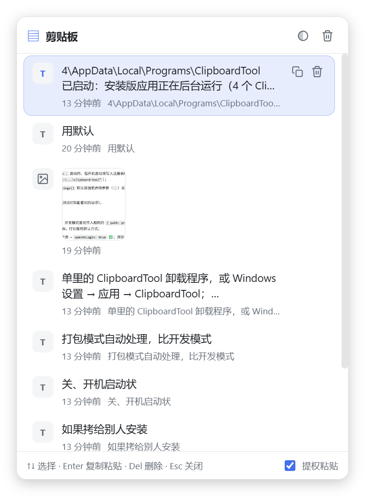
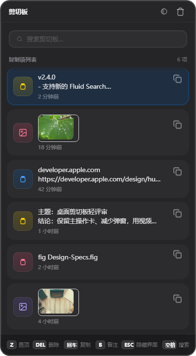

# ClipboardTool —— Windows 剪贴板历史工具

> 基于 **Electron + React + Vite** 的 Windows 桌面剪贴板工具：自动记录文字/图片历史，全局快捷键呼出，一键复制并粘贴回原输入框。



## ✨ 功能特性

- 📋 自动记录复制的**文字**和**图片**（轮询剪贴板、按内容自动去重，最多保留 200 条，本地持久化；同内容再复制不新增条目，只把原条目提升到最前，备注不受影响）
- ⌨️ 全局快捷键 **Ctrl + Shift + V** 呼出面板，**呼出时不会抢占输入框焦点**（光标和输入状态保持不变）；搜索/备注编辑需要临时聚焦面板时，会先保存原窗口和焦点控件，退出后由常驻原生助手恢复
- ⬆️⬇️ 面板显示期间，**↑ / ↓ / Enter / Esc / Del / Z / B / 空格 被全局拦截**，只作用于面板，不会误输入到原程序（搜索模式和备注编辑时让位给输入框）
- 📌 **置顶**：点击条目上的置顶图标（或面板显示期间按 `Z`）把条目固定到列表最前；支持多条置顶、重启后保留，置顶条目优先保留、不受 200 条上限自动裁剪影响
- 🔍 **搜索**：面板内按 `空格` 进入搜索（搜索框常驻顶栏下方、未激活时灰色禁用）；支持按正文文字、备注与来源应用（应用名/窗口标题）搜索、多词 AND 匹配、命中高亮；搜索时面板临时获得焦点以支持正常输入（含中文输入法），退出后立即归还；搜索结果中按 `Enter` 直接复制选中项并自动粘贴回原输入框（与浏览模式同一路径）
- 📝 **备注**：选中条目后按 `B`，或点击右侧备注图标，为该条目添加/编辑长达 200 字的单行备注；备注显示在时间后，参与搜索和高亮
- 📌 面板固定在**鼠标所在屏幕正中间**弹出
- ⚡ **Enter** 把选中项复制回剪贴板并**自动粘贴到当前输入框**，随后面板自动关闭；粘贴失败时面板保持打开并显示错误，不会向错误的窗口注入内容
- 🎨 支持**亮色 / 暗色 / 跟随系统**三种主题（右上角循环切换，自动记住选择，跟随系统模式下实时响应系统变化）
- 🗑️ 单条删除（悬停按钮或按 `Del`）、一键清空历史
- 🖱️ 系统托盘：左键/双击显示面板；右键菜单支持**开机启动**（✅/❌ 显示状态）、**更换全局快捷键**（实时显示当前组合）、退出
- 🔄 **可自定义全局快捷键**：托盘菜单点击“更换快捷键”，在面板内直接按下新组合即可生效并持久化
- 🚪 **点击面板外任意位置自动关闭面板**（全局低级鼠标钩子实现）
- 🔐 **常驻管理员权限**：整个应用以管理员权限运行，管理员窗口里的面板快捷键与自动粘贴同样生效；安装的快捷方式经计划任务静默拉起，不弹 UAC



## 🛠️ 技术栈

| 依赖 | 版本（安装时最新稳定版） |
| --- | --- |
| Electron | 43.x |
| React | 19.x |
| Vite | 8.x |
| TypeScript | 7.x |
| electron-builder | 26.x |

> 开发机需要 Node.js 20+（建议当前 LTS，如 Node 24）。

## 📁 目录结构

```
clipboard-tool/
├── electron/
│   ├── main.js          # 主进程：窗口、全局快捷键、剪贴板轮询、历史持久化、焦点恢复/自动粘贴、托盘菜单
│   ├── preload.js       # contextBridge 安全桥接
├── src/
│   ├── App.tsx          # 面板 UI：列表、键盘导航、主题、更换快捷键覆盖层
│   ├── styles.css       # 亮/暗主题样式（CSS 变量）
│   ├── main.tsx
│   └── types.ts
├── resources/           # 应用图标、托盘图标、鼠标钩子、静默启动器、焦点粘贴助手源码与构建产物
├── installer.nsh       # NSIS 自定义脚本（快捷方式→静默启动器、卸载清理计划任务）
├── scripts/
│   ├── build-helper.ps1 # 构建辅助程序
│   ├── autostart-regression.js # 开机启动计划任务回归
│   └── focus-paste-regression.js # 普通/搜索焦点恢复、Enter 粘贴与失败处理回归
├── docs/
│   └── screenshots/     # README 截图
├── index.html
├── vite.config.mts
└── package.json
```

## 🚀 使用

### 开发模式（热更新）

```bash
npm install
npm run dev
```

### 构建并运行（生产模式）

```bash
npm run build
npm start
```

### 打包 Windows 安装包

```bash
npm run dist
```

产物输出到 `release/`，NSIS 安装程序可直接安装。

### 回归测试

```bash
npm run typecheck
npm run test:autostart
npm run test:focus-paste
```

## 🎮 操作说明

| 操作 | 效果 |
| --- | --- |
| `Ctrl + Shift + V` | 呼出 / 关闭面板（全局，焦点保持在原输入框） |
| `↑` / `↓` | 选择历史项（面板显示期间由面板拦截，支持循环；搜索时作用于筛选结果） |
| `Enter` | 复制选中项到剪贴板，关闭面板并自动粘贴回当前输入框（双击、复制按钮走同一路径） |
| `Del` | 删除选中项（搜索模式下为输入框删字） |
| `Z` | 置顶 / 取消置顶选中项（搜索模式下为输入框输字母 z） |
| `B` | 添加 / 编辑选中项备注（备注编辑时输入 `b`；搜索模式下为输入框输字母 b） |
| `空格` | 浏览模式：进入搜索；搜索模式：在查询里输入空格 |
| `Enter`（备注编辑） | 保存备注 |
| `Esc` | 备注编辑：取消；搜索中：退出搜索回到浏览；浏览中：关闭面板 |
| 点击面板外 | 关闭面板（全局鼠标钩子检测） |
| 鼠标悬停 / 双击 | 选中 / 复制并粘贴 |
| 右上角按钮 | 循环切换主题（亮色 → 暗色 → 跟随系统）、清空历史 |
| 托盘图标 | 左键/双击显示面板；右键菜单：开机启动、**更换快捷键**、退出 |
| 托盘 → 更换快捷键 | 面板内弹出设置卡片，直接按下新组合键（如 `Ctrl + Alt + X`）即生效 |

> 面板是一个**不可激活（WS_EX_NOACTIVATE）**的置顶浮层：默认不抢走输入框焦点，全程键盘即可操作；仅按 `空格` 进入搜索或编辑备注时临时变为可聚焦以支持文字输入（含中文输入法），退出后由常驻原生助手把焦点和输入状态归还原程序。

## 💾 数据存储

- 历史索引（含置顶标记与备注）：`%APPDATA%\ClipboardTool\clipboard-history.json`
- 图片文件：`%APPDATA%\ClipboardTool\images\*.png`
- 设置（主题、自定义快捷键、开机启动意图）：`%APPDATA%\ClipboardTool\settings.json`

## 📌 注意事项

- `Enter` / 双击 / 复制按钮触发后总是自动粘贴：主进程先通过常驻 `focus-paste-helper.exe` 恢复呼出前记录的窗口与焦点控件，再注入 `Ctrl+V`。应用整体以**管理员权限**运行（`requestedExecutionLevel: requireAdministrator`），因此即使目标程序也是管理员权限，快捷键与粘贴同样生效，无需任何开关；助手直接继承主进程的令牌，不额外弹 UAC。
- **无 UAC 打扰**：安装创建的桌面/开始菜单快捷方式指向 `task-launcher.exe`，经计划任务 `ClipboardToolElevated`（最高权限）静默拉起主程序，不弹 UAC；开机启动同样走该任务的 `onlogon` 触发器。唯一例外：直接双击 `ClipboardTool.exe` 本体会弹一次 UAC（保证永远提权）。
- 若 `Ctrl+Shift+V` 或面板的 `↑/↓/Enter/Esc/Del/Z/B` 与其它软件的全局快捷键冲突，注册会失败并在控制台提示，此时按键会照常进入原程序。
- 更换快捷键时，新组合必须包含 `Ctrl` / `Alt` / `Win` 之一作为修饰键；`Esc` 可随时取消。
- 搜索模式下 `Space` / `Z` / `Del` 让位给搜索输入框（输入空格、打字、删字），`↑↓ / Esc` 仍操作面板，`Enter` 直接复制选中项并自动粘贴回原输入框；中文输入法组合期间（如候选词选择）面板导航键会暂时全部让位给输入法。
- 面板关闭时程序仍在后台运行（托盘图标常驻），用于持续监听剪贴板和响应全局快捷键。

## 📄 License

MIT
